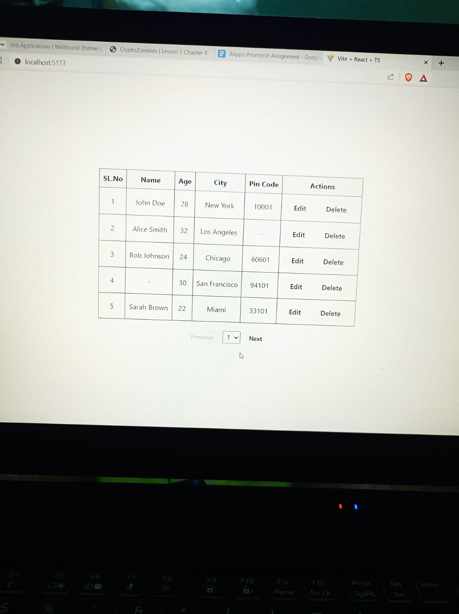
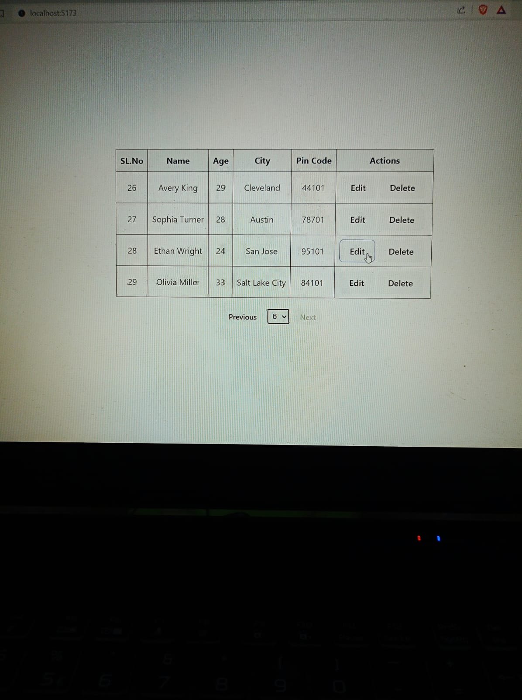
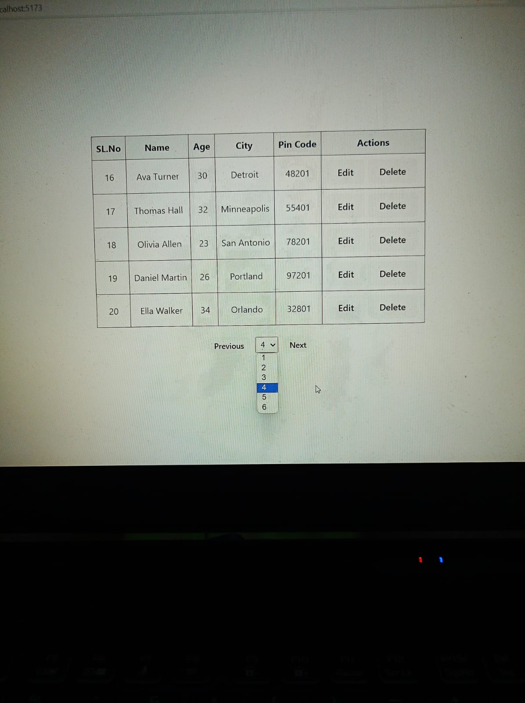
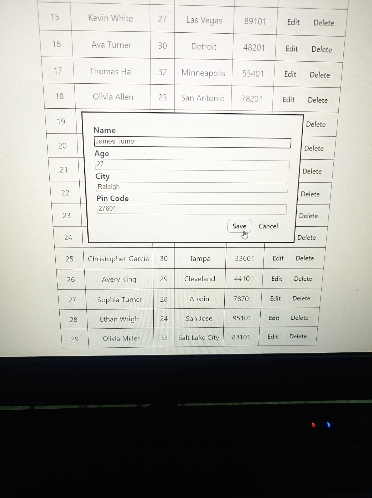
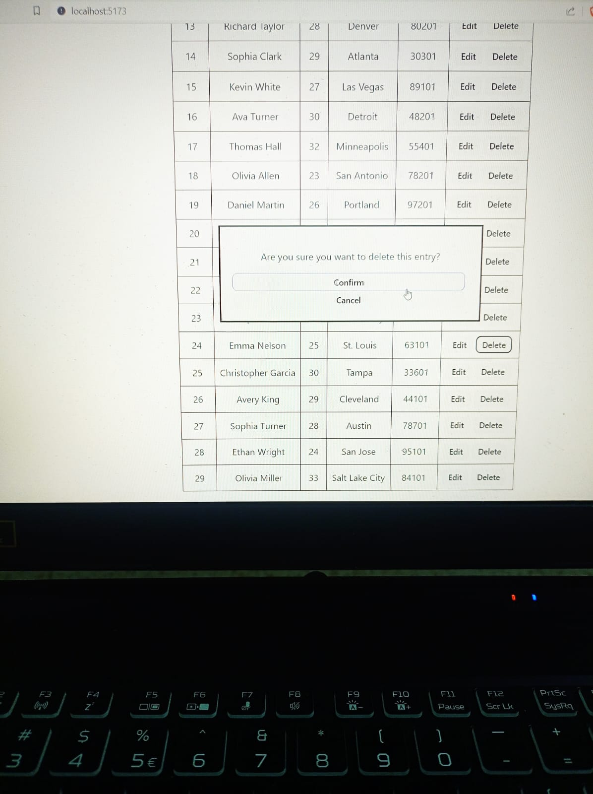

# React + TypeScript + Vite

# Synopsis

This React application fetches data from an external API using Axios and displays it in an organized table format. The table showcases individual details, including names, ages, cities, and pin codes. Enhanced with pagination for easy navigation, the table also features edit and delete functionalities. Users can edit entries by clicking the "Edit" button, triggering a modal for name modification. The "Delete" button initiates a confirmation modal for entry deletion. Pagination controls facilitate seamless exploration through the dataset. Simple usage instructions guide users to interact effortlessly, making this application an intuitive solution for data exploration and management.

# Snippets

